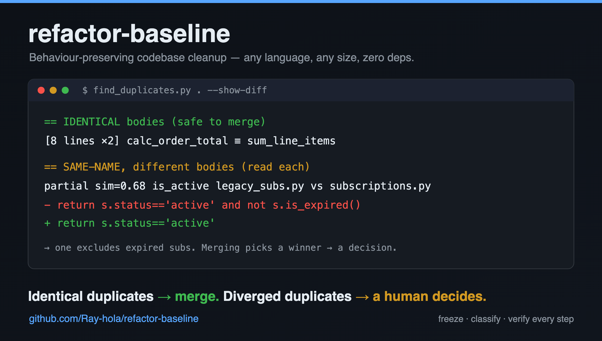

# refactor-baseline

[](https://github.com/Ray-hola/refactor-baseline/actions/workflows/ci.yml)
[](LICENSE)
[](https://www.python.org/downloads/)


<p align="center">
  
</p>

An agent skill for **behaviour-preserving codebase cleanup**, for any language and any size. It freezes a baseline first (tests, external interfaces, metrics). It then classifies every finding by whether fixing it preserves behaviour, and makes changes in small steps, each verified against that baseline.

The rule at its centre: **identical duplicates are safe to merge; diverged duplicates are not.** When two copies of one concept have drifted apart, merging them is a product decision, so it is surfaced to a human instead of being shipped as "dedupe".

The workflow draws on Nous Research's [Refactoring Hermes with 1,393 agents](https://nousresearch.com/refactoring-hermes-with-1393-agents) (frozen baseline, byte-for-byte interface checks, commit after every verified step). It adds the identical-vs-diverged split, batching by who must decide, and a list of regressions to catch.

> **See it run:** [examples/README.md](examples/README.md) walks all three scripts over a small synthetic project in about 30 seconds — including the identical-vs-diverged call that is the whole point.

## Why this approach

Most cleanup tools optimise a number — lines removed, duplicates merged — and let behaviour take care of itself. This one inverts that: **behaviour is the invariant, and the metrics only rank the work.**

The philosophy, in three moves:

- **Freeze before you touch.** Record the test results, the externally visible interfaces (byte for byte) and the metrics first. That frozen baseline — not your memory of how things worked — is what every later step is judged against.
- **Classify by consequence, not by looks.** Two functions can be byte-identical and safe to merge, or merely look similar while hiding a real behaviour difference. The scripts surface *leads*; a verdict comes only after reading the code. Anything that would change what a caller observes is a **decision**, routed to a human — never shipped as "dedupe".
- **Change in small, verified, committed steps.** One coherent change at a time, each re-checked against the baseline (static check → tests → snapshot → an A/B probe for untested paths) and committed with the evidence. No step claims "behaviour unchanged" without test, snapshot or A/B proof.

What you get from it:

| Advantage | Why it holds |
|---|---|
| **Regressions can't slip in silently** | Every step is diffed against a frozen tests + interface baseline; any drift stops the run. |
| **Fast wins without the risky ones** | Mechanical fixes (identical merges, dispatch tables, cycle breaks) proceed automatically; consequential ones are pulled out for a human. That split is the whole point. |
| **Works anywhere** | One workflow for any language and any size — a single package up to a 2.7M-line monorepo — because it keys off observable behaviour, not a specific toolchain. |
| **Drops in with zero setup** | stdlib-only Python, no dependencies, no install — runs locally, in CI, or across parallel agents in separate worktrees. |
| **Catches mistakes that pass tests** | A checklist of [16 real regressions](references/pitfalls.md) (shadowed imports, diverged merges, vacuous A/B runs, dispatch-order changes…) that green suites miss. |
| **Honest by construction** | The report leads with verification evidence and ends with the decisions a human still owns — no "trust me, it's fine". |

## What's inside

| Path | Purpose |
|---|---|
| `SKILL.md` | The workflow: orient → kickoff contract → freeze → find → batch → execute and verify → report |
| `scripts/measure.py` | LOC by language, size tier, big files, long functions, routing chains, CRLF/BOM hygiene. For Python: private cross-module imports, function-level imports, import cycles. Skips generated and minified files. |
| `scripts/find_duplicates.py` | Python: IDENTICAL bodies (after renaming parameters and locals) and SAME-NAME pairs with diffs. All languages: cloned blocks. |
| `scripts/snapshot.py` | Records command outputs (stdout, stderr, exit code) and compares them byte for byte, with masks for volatile text |
| `references/pitfalls.md` | 16 regressions that passed test suites, and how to catch each one |
| `references/project-types.md` | What to freeze for a library, CLI, service, frontend, data/ML, agent tooling, monorepo or infra project, plus static checks per language |
| `references/baseline-template.md` | A baseline document to fill in |
| `tests/` | Stdlib `unittest` suite covering all three scripts (run with `python3 -m unittest discover -s tests -t .`) |
| `examples/` | A 30-second worked run on a synthetic toy project — see [examples/README.md](examples/README.md) |

The scripts use only the Python 3.9+ standard library; there are no dependencies. They have been checked on a 26k-line Python project, a 190k-line TypeScript app and a 2.7M-line mixed Python/TypeScript monorepo (about 40 s per script).

## Install

Copy or clone the folder into your agent's skills directory:

```bash
git clone git@github.com:Ray-hola/refactor-baseline.git ~/.claude/skills/refactor-baseline   # Claude Code
# other runtimes: ~/.agents/skills/, ~/.codex/skills/, ~/.cursor/skills/, ...
```

The scripts also work on their own:

```bash
python3 scripts/measure.py /path/to/repo --json before.json
python3 scripts/find_duplicates.py /path/to/repo --show-diff
python3 scripts/snapshot.py record  --commands probes.txt
python3 scripts/snapshot.py compare --commands probes.txt
```

## Tests

The scripts ship with a stdlib-only test suite (no `pytest`, no install). Run it from the repo root:

```bash
python3 -m unittest discover -s tests -t . -b -v
```

CI runs the suite on Python 3.9–3.13 and smoke-runs all three scripts on this repo; see [`.github/workflows/ci.yml`](.github/workflows/ci.yml). Contributions welcome — see [CONTRIBUTING.md](CONTRIBUTING.md).

## Credits & source

The workflow builds on Nous Research's write-up of a large-scale agent refactor:

- **Refactoring Hermes with 1,393 agents** — Nous Research (Teknium): <https://nousresearch.com/refactoring-hermes-with-1393-agents>

From it comes the spine of the method: a frozen baseline, byte-for-byte interface checks, and a commit after every verified step. This project adds the **identical-vs-diverged** classification, **batching by who must decide**, and the **[16-regression checklist](references/pitfalls.md)**.

The upfront **kickoff contract** (Phase 0.5) — interview the human once to fix the operating rules, then run unattended — adapts the one-question-at-a-time interview pattern from the [grill-me](https://github.com/satya-janghu/agent-skills) skill.

Project home: <https://github.com/Ray-hola/refactor-baseline>

---

## 中文说明

一个用于**"行为不变"代码清理**的 Agent Skill，适用于各种语言、各种规模的项目。流程是：先冻结基线（测试、对外接口、度量）；再把每个问题按"修复后行为是否保持不变"分类；最后小步修改，每一步都对照基线验证后再提交。

核心规则：**逐字相同的重复可以放心合并；已经分叉的重复不能直接合并。** 同一概念的两份副本如果已经不一致，合并就等于替部分调用方改变了行为。这属于产品决策，必须交给人来拍板，不能当作"去重"顺手做掉。

- `SKILL.md`：完整流程。先摸清项目规则，开工前先用一轮"启动契约"（Phase 0.5）与人确定作业规则（范围、自主权、红线），随后冻结基线、找问题、分批（机械改动 / 需人决策 / 结构拆分）、逐步执行并验证，最后汇报。
- `scripts/`：三个只依赖标准库的脚本，分别做度量、重复检测（区分相同与分叉）、接口快照比对。
- `references/`：常见回归清单、按项目类型列出的应冻结接口、基线文档模板。

安装：把本目录复制到所用 Agent 的 skills 目录，例如 `~/.claude/skills/refactor-baseline`。

### 重构理念

多数清理工具优化的是"数字"——删了多少行、合并了多少重复——却把行为交给运气。本项目反过来：**行为是不可变量，度量只用来给工作排优先级。**

- **先冻结，再动手。** 先记录测试结果、对外接口（逐字节）和度量,以此作为之后每一步的对照基准——而不是凭记忆判断"本来是怎样"。
- **按后果分类，而不是按长相。** 两个函数可能逐字相同、可以安全合并，也可能只是看着相似却藏着真实的行为差异。脚本只给*线索*，读完代码才下结论。任何会改变调用方可见行为的改动都是**决策**，交给人，绝不当"去重"顺手做掉。
- **小步改、每步验证、每步提交。** 一次一个改动，每步都对照冻结基线复查（静态检查 → 测试 → 快照 → 无测试路径补 A/B 探针），并带着证据提交。没有测试/快照/A-B 证据，就不声称"行为不变"。

### 优势

- **回归无法悄悄溜进来**：每步都与冻结的测试 + 接口基线做 diff，一有偏差就停。
- **快，但不冒险**：机械改动（相同合并、dispatch 表、拆环）自动做；有后果的单独拎出来交给人——这个区分正是核心价值。
- **到处能用**：一套流程适配任意语言、任意规模（从单个包到 270 万行 monorepo），因为它盯的是可观察行为，不绑定具体工具链。
- **零配置即插即用**：纯标准库 Python，无依赖、免安装，本地 / CI / 多 Agent 并行 worktree 都能跑。
- **抓住能骗过测试的错误**：一份 [16 条真实回归清单](references/pitfalls.md)（遮蔽导入、分叉合并、无效 A/B、dispatch 顺序变化……），都是绿色测试套件会漏掉的。

### 来源

方法论借鉴自 Nous Research 关于大规模 Agent 重构的文章：

- **Refactoring Hermes with 1,393 agents** — Nous Research（Teknium）：<https://nousresearch.com/refactoring-hermes-with-1393-agents>

本项目在其"冻结基线、逐字节接口校验、每步验证后提交"的骨架上，补充了**相同 vs 分叉**的分类、**按决策归属分批**，以及 **16 条回归清单**。

开工前的**启动契约**（Phase 0.5）——先用"一次一个问题、每题附推荐答案"的方式与人敲定作业规则，之后无人值守地执行——借鉴自 [grill-me](https://github.com/satya-janghu/agent-skills) skill 的访谈模式。

项目主页：<https://github.com/Ray-hola/refactor-baseline>

## License

MIT
